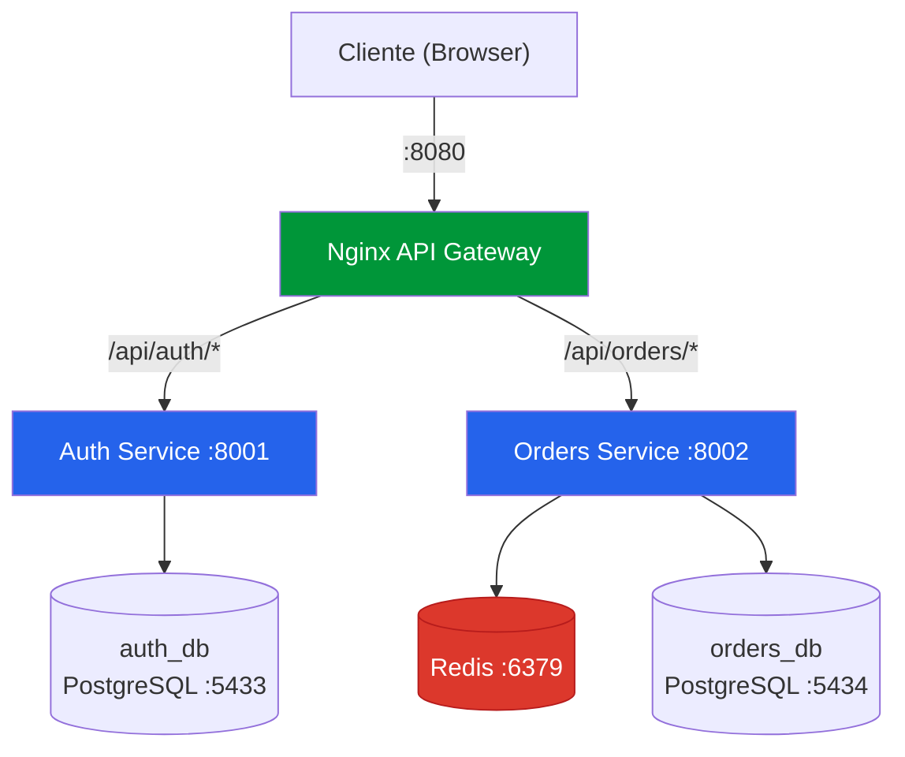
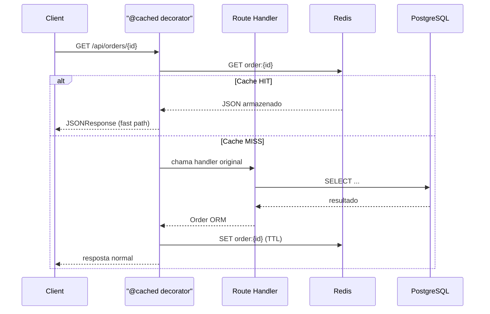

# Plataforma de Gestão de Pedidos — PMV

Plataforma interna de gestão de pedidos para e-commerce, construída com arquitetura de microsserviços (FastAPI) e API Gateway (Nginx).

---

##  Arquitetura



### Componentes

| Componente | Tecnologia | Porta | Descrição |
|------------|-----------|-------|-----------|
| API Gateway | Nginx 1.25 | 8080 | Reverse proxy, roteamento por path |
| Auth Service | FastAPI + Python 3.12 | 8001 | Autenticação, gestão de usuários, JWT |
| Orders Service | FastAPI + Python 3.12 | 8002 | CRUD de pedidos, filtros por status |
| Auth DB | PostgreSQL 16 | 5433 | Banco exclusivo do serviço de auth |
| Orders DB | PostgreSQL 16 | 5434 | Banco exclusivo do serviço de pedidos |
| Cache | Redis 7 | 6379 | Cache de respostas do Orders Service |

---

## 🚀 Como Executar

### Pré-requisitos
- Docker e Docker Compose instalados

### Subir a stack completa

```bash
docker-compose up --build -d
```

### Verificar saúde dos serviços

```bash
# Gateway
curl http://localhost:8080/health

# Auth Service
curl http://localhost:8080/api/auth/health

# Orders Service
curl http://localhost:8080/api/orders/health
```

### Acessar documentação Swagger

- **Auth Service:** http://localhost:8080/api/auth/docs
- **Orders Service:** http://localhost:8080/api/orders/docs

---

## 📡 Endpoints da API

### Auth Service (`/api/auth`)

| Método | Endpoint | Descrição | Autenticação |
|--------|----------|-----------|-------------|
| POST | `/api/auth/register` | Registrar novo usuário | Não |
| POST | `/api/auth/login` | Login (retorna JWT) | Não |
| GET | `/api/auth/users` | Listar usuários | JWT |
| GET | `/api/auth/users/me` | Dados do usuário logado | JWT |

### Orders Service (`/api/orders`)

| Método | Endpoint | Descrição | Autenticação |
|--------|----------|-----------|-------------|
| GET | `/api/orders/` | Listar pedidos (filtro por status) | JWT |
| POST | `/api/orders/` | Criar pedido | JWT |
| GET | `/api/orders/{id}` | Consultar pedido por ID | JWT |
| PATCH | `/api/orders/{id}/status` | Atualizar status do pedido | JWT |

### Exemplo de uso

```bash
# 1. Registrar usuário
curl -X POST http://localhost:8080/api/auth/register \
  -H "Content-Type: application/json" \
  -d '{"email":"admin@empresa.com","password":"senha123","full_name":"Admin"}'

# 2. Login
TOKEN=$(curl -s -X POST http://localhost:8080/api/auth/login \
  -H "Content-Type: application/json" \
  -d '{"email":"admin@empresa.com","password":"senha123"}' | python3 -c "import sys,json; print(json.load(sys.stdin)['access_token'])")

# 3. Criar pedido
curl -X POST http://localhost:8080/api/orders/ \
  -H "Content-Type: application/json" \
  -H "Authorization: Bearer $TOKEN" \
  -d '{
    "customer_name": "Cliente A",
    "items": [
      {"product_name": "Notebook Dell", "quantity": 1, "unit_price": 4500.00},
      {"product_name": "Mouse Logitech", "quantity": 2, "unit_price": 89.90}
    ]
  }'

# 4. Listar pedidos
curl http://localhost:8080/api/orders/ -H "Authorization: Bearer $TOKEN"

# 5. Filtrar por status
curl "http://localhost:8080/api/orders/?status=pending" -H "Authorization: Bearer $TOKEN"

# 6. Atualizar status
curl -X PATCH http://localhost:8080/api/orders/{ORDER_ID}/status \
  -H "Content-Type: application/json" \
  -H "Authorization: Bearer $TOKEN" \
  -d '{"status": "confirmed"}'
```

---

## 🔧 Decisões Técnicas

### Por que FastAPI em vez de Django REST Framework?
- **Performance**: async nativo com `asyncpg`, sem overhead de synchronous ORM
- **Documentação automática**: Swagger/OpenAPI gerado automaticamente via Pydantic
- **Tipagem forte**: validators e serializers derivados dos type hints
- **Leveza**: ideal para microsserviços, sem o "batteries-included" do Django que seria desnecessário

### Por que SQLAlchemy 2.0 + asyncpg?
- ORM robusto com suporte a async sessions
- Migrações versionadas via Alembic
- Compatível com o padrão async do FastAPI sem adaptadores

### Por que Nginx como API Gateway?
- Reverse proxy leve e battle-tested
- Roteamento simples por path prefix (`/api/auth/`, `/api/orders/`)
- Facilmente extensível para load balancing, rate limiting, SSL termination

### Por que JWT compartilhado?
- **Stateless**: cada serviço valida o token sem chamada de rede ao auth-service
- **Simplicidade**: mesma `SECRET_KEY` injetada via environment variables no Docker Compose
- **Escalabilidade**: novos serviços só precisam da chave para validar tokens

### Banco de dados separados (Database per Service)
- Isolamento total entre domínios
- Cada serviço é dono do seu schema
- Permite escolher tecnologias diferentes por serviço no futuro

### Cache com Redis (Orders Service)

O serviço de pedidos utiliza **Redis** como cache de respostas, implementado via **decorators** aplicados na camada de rotas. A camada de serviço (regras de negócio) permanece inalterada.



#### Decorators

| Decorator | Aplicado em | Função |
|---|---|---|
| `@cached(prefix, ttl)` | Endpoints `GET` | Cache-aside — gera a chave automaticamente a partir dos parâmetros da rota |
| `@invalidates_cache(*patterns)` | Endpoints `POST`, `PATCH` | Invalida chaves após escrita, suporta wildcards (`*`) e interpolação (`{order_id}`) |

#### Configuração

| Variável | Default | Descrição |
|---|---|---|
| `REDIS_URL` | `redis://redis:6379/0` | URL de conexão do Redis |
| `CACHE_ENABLED` | `true` | Desativar cache sem remover o código |
| `CACHE_TTL_ORDER` | `600` | TTL em segundos para pedido individual |
| `CACHE_TTL_ORDER_LIST` | `300` | TTL em segundos para listagens |

#### Resiliência
- Se o Redis estiver indisponível, o app continua funcionando normalmente via PostgreSQL
- Erros de cache são apenas logados, nunca propagados
- `CACHE_ENABLED=false` desabilita o cache por completo

---

## 📋 O que ficaria diferente com mais tempo

### Implementaria
- **Alembic migrations** versionadas (atualmente tabelas são criadas pelo ORM no startup)
- **Comunicação assíncrona** entre serviços via Redis Pub/Sub ou RabbitMQ
- **Observabilidade** com logs estruturados (structlog), métricas (Prometheus) e tracing (OpenTelemetry)
- **Rate limiting** no Nginx
- **SSL/TLS** termination no gateway

### Decisões que não tomei e por quê
- **Não usei Django REST Framework**: apesar de mais popular, seria overengineering para um PMV com microsserviços simples
- **Não implementei event sourcing**: complexidade desnecessária neste estágio; CRUD é suficiente para o domínio atual
- **Não separei em multi-repo**: a facilidade do mono-repo para Docker Compose e CI supera a independência de deploy neste PMV
- **Não usei API Gateway dedicado (Kong, Traefik)**: Nginx atende perfeitamente o caso de uso atual e é mais simples de configurar

---

## 🛑 Parar a stack

```bash
docker-compose down

# Para remover também os volumes (dados):
docker-compose down -v
```
