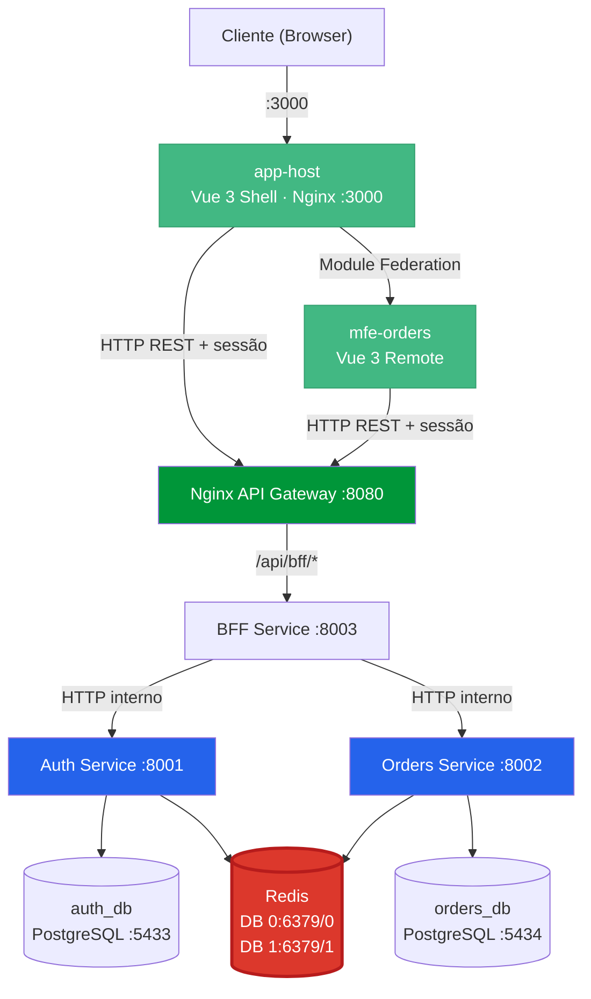
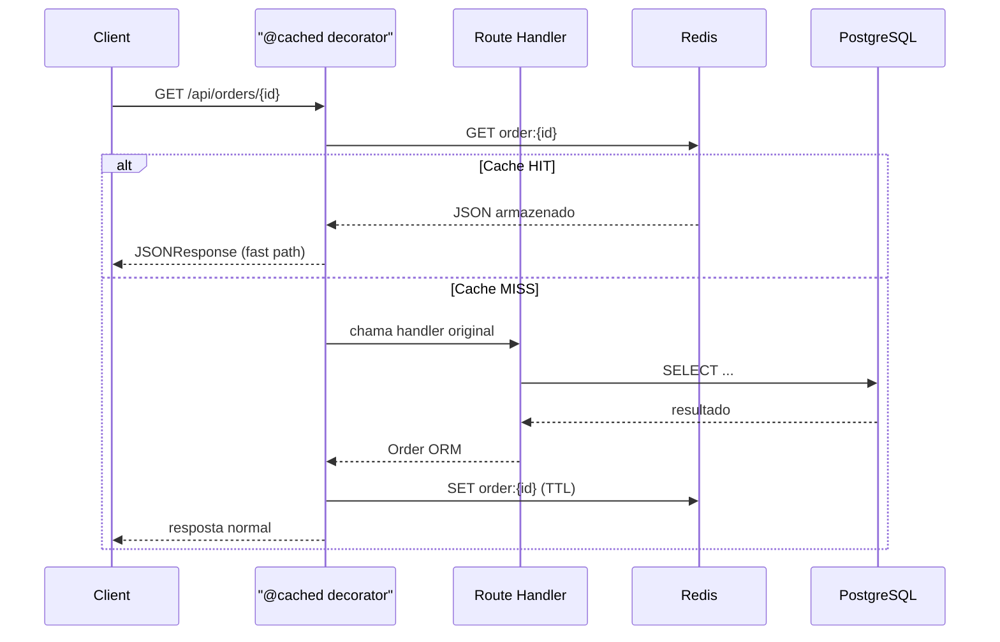

# Plataforma de Gestão de Pedidos — E-cCC

Plataforma interna de gestão de pedidos para e-commerce (E-Commerce Casa Cívil), construída com arquitetura de micro-frontends (Vue 3 + Module Federation) e microsserviços (FastAPI), comunicando-se via Nginx como API Gateway.

https://github.com/user-attachments/assets/66860695-3e0c-495c-9ec2-f88c8496ec6f


---

## Arquitetura



### Componentes

| Componente | Tecnologia | Porta | Descrição |
|------------|-----------|-------|-----------|
| App Host | Vue 3 + Vite · Nginx | 3000 | Shell do frontend (Module Federation host) |
| MFE Orders | Vue 3 + Vite · Nginx | 3001 | Micro-frontend de pedidos (remote) |
| API Gateway | Nginx 1.25 | 8080 | Reverse proxy, roteamento por path |
| BFF Service | FastAPI + Python 3.12 | 8003 | Backend for Frontend (sessão via cookie HttpOnly) |
| Auth Service | FastAPI + Python 3.12 | 8001 | Autenticação, gestão de usuários, JWT RS256 |
| Orders Service | FastAPI + Python 3.12 | 8002 | CRUD de pedidos, filtros por status |
| Auth DB | PostgreSQL 16 | 5433 | Banco exclusivo do serviço de auth |
| Orders DB | PostgreSQL 16 | 5434 | Banco exclusivo do serviço de pedidos |
| Redis DB 0 | Redis 7 | 6379/0 | Cache do Orders Service |
| Redis DB 1 | Redis 7 | 6379/1 | Cache do Auth Service |

---

## 🖥️ Frontend

A camada de apresentação é composta por dois aplicativos Vue 3 com **Module Federation (Vite)**:

### app-host — Shell da aplicação

- Vue 3 + Vuetify 3 + Vue Router
- Gerencia autenticação (login, registro, logout)
- Carrega o `mfe-orders` dinamicamente em runtime
- **Guarda de rota baseada em sessão no BFF**: valida sessão via `/api/bff/session` e redireciona para `/login` quando a sessão não está válida

**Páginas:**

| Rota | Página | Descrição |
|------|--------|-----------|
| `/login` | LoginPage | Formulário de login |
| `/register` | RegisterPage | Registro de novo usuário |
| `/home` | HomePage | Dashboard do usuário autenticado |
| `/users` | UsersPage | Listagem de usuários com busca e filtro de status |
| `/orders` | OrdersList (MFE) | Listagem de pedidos (carregado via Module Federation) |
| `/orders/create` | OrderCreate (MFE) | Criação de pedido (carregado via Module Federation) |

### mfe-orders — Micro-frontend de pedidos

- Vue 3 exposto como remote via Module Federation
- Expõe `OrdersList` e `OrderCreate` para consumo pelo `app-host`

---

## 🚀 Como Executar

### Pré-requisitos
- Docker e Docker Compose instalados

### Subir a stack completa

```bash
docker compose up --build -d
```

### Verificar saúde dos serviços

```bash
curl http://localhost:8080/api/bff/health
```

### Acessar a aplicação

- **Frontend:** http://localhost:3000
- **BFF API Docs:** http://localhost:8080/api/bff/docs

---

## 📡 Endpoints da API

### BFF Service (`/api/bff`)

| Método | Endpoint | Descrição |
|--------|----------|-----------|
| POST | `/api/bff/auth/register` | Registro de usuário (proxy auth) |
| POST | `/api/bff/auth/login` | Login e criação de cookie HttpOnly |
| POST | `/api/bff/auth/logout` | Encerrar sessão |
| GET | `/api/bff/session` | Validar sessão e obter usuário atual |
| GET | `/api/bff/users` | Listar usuários autenticado via sessão |
| GET | `/api/bff/users/me` | Dados do usuário logado |
| GET | `/api/bff/orders/` | Listar pedidos |
| POST | `/api/bff/orders/` | Criar pedido |
| PATCH | `/api/bff/orders/{id}/status` | Atualizar status do pedido |

> Os endpoints de `Auth Service` e `Orders Service` continuam existindo internamente para comunicação entre serviços, mas não são mais expostos pelo API Gateway.

### Exemplo de uso

```bash
# 1. Registrar usuário (via BFF)
curl -X POST http://localhost:8080/api/bff/auth/register \
  -H "Content-Type: application/json" \
  -d '{"email":"admin@empresa.com","password":"senha123","full_name":"Admin"}'

# 2. Login e persistência de cookie de sessão
curl -i -c cookies.txt -X POST http://localhost:8080/api/bff/auth/login \
  -H "Content-Type: application/json" \
  -d '{"email":"admin@empresa.com","password":"senha123"}'

# 3. Criar pedido (usando cookie de sessão)
curl -b cookies.txt -X POST http://localhost:8080/api/bff/orders/ \
  -H "Content-Type: application/json" \
  -d '{
    "customer_name": "Cliente A",
    "items": [
      {"product_name": "Notebook Dell", "quantity": 1, "unit_price": 4500.00},
      {"product_name": "Mouse Logitech", "quantity": 2, "unit_price": 89.90}
    ]
  }'

# 4. Listar pedidos
curl -b cookies.txt http://localhost:8080/api/bff/orders/

# 5. Atualizar status
curl -b cookies.txt -X PATCH http://localhost:8080/api/bff/orders/{ORDER_ID}/status \
  -H "Content-Type: application/json" \
  -d '{"status": "confirmado"}'

# 6. Encerrar sessão
curl -b cookies.txt -X POST http://localhost:8080/api/bff/auth/logout
```

---

## 🔧 Decisões Técnicas

### Por que FastAPI em vez de Django REST Framework?
- **Performance**: async nativo com `asyncpg`, sem overhead de synchronous ORM
- **Documentação automática**: Swagger/OpenAPI gerado automaticamente via Pydantic
- **Tipagem forte**: validators e serializers derivados dos type hints
- **Leveza**: ideal para microsserviços, sem o "batteries-included" do Django que seria desnecessário

### Por que Nginx como API Gateway?
- Reverse proxy leve e battle-tested
- Ponto único de entrada para o frontend, expondo apenas o BFF (`/api/bff/`)
- Facilmente extensível para load balancing, rate limiting, SSL termination

### Por que JWT RS256 (assimétrico)?
- **Stateless**: cada serviço valida o token com a chave pública sem chamada de rede
- **Segurança**: somente o Auth Service possui a chave privada para assinar tokens
- **Escalabilidade**: novos serviços só precisam da chave pública para validar

### Banco de dados separados (Database per Service)
- Isolamento total entre domínios
- Cada serviço é dono do seu schema
- Permite escolher tecnologias diferentes por serviço no futuro

### Cache com Redis (decorator pattern)

O cache é implementado via **decorators** na camada de rotas. A camada de serviço permanece inalterada.



| Decorator | Aplicado em | Função |
|---|---|---|
| `@cached(prefix, ttl)` | Endpoints `GET` | Cache-aside — chave gerada automaticamente a partir dos parâmetros da rota |
| `@invalidates_cache(*patterns)` | Endpoints `POST`, `PATCH` | Invalida chaves após escrita, suporta wildcards e interpolação |

| Variável | Default | Descrição |
|---|---|---|
| `CACHE_ENABLED` | `true` | Desativar cache sem remover o código |
| `CACHE_TTL_ORDER` | `600` | TTL em segundos para pedido individual |
| `CACHE_TTL_ORDER_LIST` | `300` | TTL em segundos para listagens |

> Se o Redis estiver indisponível, o app continua funcionando normalmente via PostgreSQL (graceful degradation).

### Sessão no frontend via BFF

O frontend não armazena mais JWT em `localStorage`. A autenticação é feita com cookie HttpOnly emitido pelo BFF, e o Vue Router valida a sessão pelo endpoint `/api/bff/session`.

---

## 🧪 CI/CD

O repositório utiliza **GitHub Actions** com uma pipeline que executa os testes unitários de cada serviço **somente quando seu código muda** a cada push.

```yaml
# .github/workflows/tests.yml
jobs:
  changes:         # detecta quais serviços foram modificados
    uses: dorny/paths-filter@v4

  test-auth:       # roda apenas se services/auth/** mudou
    if: needs.changes.outputs.auth == 'true'

  test-orders:     # roda apenas se services/orders/** mudou
    if: needs.changes.outputs.orders == 'true'
```

- **Paths filter**: testes de um serviço não rodam quando apenas o outro muda
- Testes rodam com **SQLite em memória** — nenhum serviço externo necessário
- Chaves RSA do JWT são injetadas via **GitHub Secrets** (`JWT_PRIVATE_KEY`, `JWT_PUBLIC_KEY`)
- Cobertura atual: 15 testes (auth) + 33 testes (orders)

---

## 📋 O que ficaria diferente com mais tempo

### Implementaria
- **Alembic migrations** versionadas (atualmente tabelas são criadas pelo ORM no startup)
- **Catálogo e estoque** como serviços separados
- **Comunicação assíncrona** entre serviços via Redis Pub/Sub ou RabbitMQ
- **Observabilidade** com logs estruturados (structlog), métricas (Prometheus) e tracing (OpenTelemetry)

### Decisões que não tomei e por quê
- **Não usei Django REST Framework**: seria overengineering para um PMV com microsserviços simples
- **Não implementei event sourcing**: complexidade desnecessária neste estágio; CRUD é suficiente para o domínio atual
- **Não separei em multi-repo**: a facilidade do mono-repo para Docker Compose e CI supera a independência de deploy neste PMV
- **Não usei API Gateway dedicado (Kong, Traefik)**: Nginx atende perfeitamente o caso de uso atual

---

## 🛑 Parar a stack

```bash
docker compose down

# Para remover também os volumes (dados):
docker compose down -v
```
